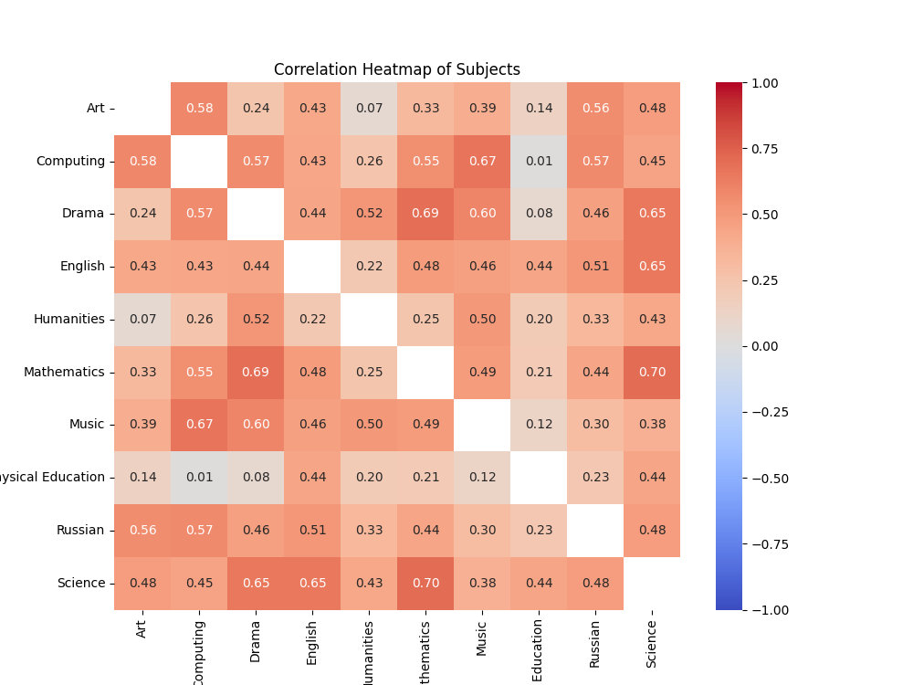

<h1 style="text-align: center;">Subject to Grade Correlation</h1>
<p style="text-align: center;">The Subject to Grade Correlation project aims to analyze the correlation between grades across different subjects. By visualizing this correlation, users can gain insights into how performance in one subject relates to performance in others..</p>


## Important notes
- The report cards provided in the `report_cards` directory are simulated and generated for demonstration purposes.
- If you wish to use this project with report cards of a different format, modifications to the `report_cards.main()` function in `report_cards.py` may be necessary.
- Running the `analyze.py` script directly (not as an import) will generate an Excel spreadsheet file named `correlation_results.xlsx`.

## Setup
To set up the project, install the required dependencies using the following command:
```bash
pip3 install -r requirements.txt
```

## Run
Run the main script: 
```bash
python3 main.py
```
The main script begins by extracting grades from PDF report cards located in the `report_cards` directory and storing them in JSON files. Subsequently, it generates a heatmap and network nodes to visualize the correlation coefficient among subjects.

## Images
<figure>
    
    <figcaption>Grade correlation based on real school report cards (not public report cards)</figcaption>
</figure>

## License
This project is under the GPL-3.0 license. Read more [here](LICENSE).
